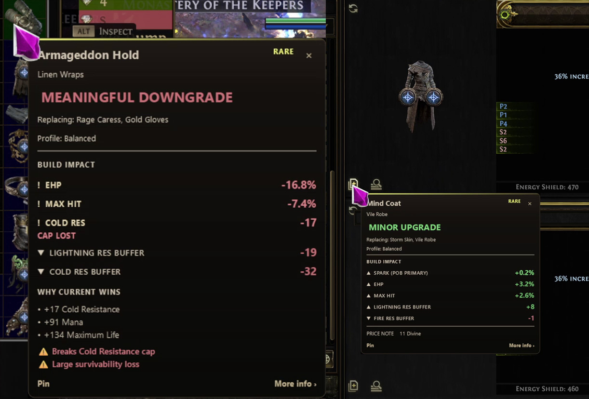

# ExileLens

**Know if an item is actually better for your build.**

Free and open-source, build-aware item analysis for Path of Exile 2.

[Download releases](https://github.com/arewoz/ExileLens/releases) · [Report an issue](https://github.com/arewoz/ExileLens/issues) · [Discord](https://discord.gg/4jrhBbSwEn)



ExileLens evaluates the item you are hovering against your actual Path of Building 2 build and shows an upgrade, downgrade, sidegrade or uncertain verdict in an overlay.

Instead of using a generic item score, ExileLens compares the candidate item against the equipment, skills, passive tree and other active context in your selected PoB2 build.

> **Beta:** ExileLens is under active development. Unsupported mechanics and occasional incorrect evaluations are still possible.

ExileLens is an unofficial, fan-made project and is not affiliated with or endorsed by Grinding Gear Games or the Path of Building project. Path of Exile and Path of Exile 2 are trademarks of Grinding Gear Games.

## Download

Download the latest Windows build from:

**[GitHub Releases](https://github.com/arewoz/ExileLens/releases)**

Official ExileLens Windows builds are distributed only through GitHub Releases in this repository. Each release provides a ZIP package and `SHA256SUMS.txt` for verifying that ZIP.

ExileLens is currently unsigned. Windows SmartScreen or antivirus software may warn about the executable, especially on first run.

See [`SECURITY.md`](SECURITY.md) for details about the application's security model, Windows warnings and release integrity.

## Install and use

1. Install [Path of Building Community for Path of Exile 2](https://github.com/PathOfBuildingCommunity/PathOfBuilding-PoE2) separately.
2. Download the latest ExileLens Windows ZIP package and its `SHA256SUMS.txt` from [GitHub Releases](https://github.com/arewoz/ExileLens/releases).
3. Optionally verify the ZIP against `SHA256SUMS.txt`, then extract the ZIP.
4. Start `ExileLens.exe`. The ZIP also contains `README.txt` with setup, controls, and troubleshooting.
5. During setup, select your Path of Building 2 installation and saved build.
6. Start Path of Exile 2.
7. Hover an item and press `Shift+C`.

ExileLens copies the hovered item's text using Path of Exile 2's normal copy-item functionality, evaluates it against your selected PoB2 build and displays the result in the overlay. The hotkey can be changed under Dashboard → Settings → Hotkey.

## Requirements

- Windows 10 or Windows 11, 64-bit
- Path of Exile 2
- Path of Building Community for Path of Exile 2
- A saved Path of Building 2 build

> **Path of Building 2 is currently required and is not bundled with ExileLens.**

ExileLens uses your selected PoB2 build as the comparison baseline.

## What ExileLens does

ExileLens is designed to answer one question:

> **Is this item actually better for my build?**

It currently provides:

- Build-aware item comparison using Path of Building 2 calculations
- Upgrade, downgrade, sidegrade and uncertain evaluations
- Offensive, defensive and utility impact analysis
- Comparison against your currently selected PoB2 equipment and build context
- Overlay results without manually moving every candidate item into PoB
- Optional live market pricing using Path of Exile trade data
- Detailed reasoning for supported evaluations
- Local operation without an ExileLens account or telemetry system

## Current limitations

ExileLens is still in beta.

Current limitations include:

- Windows only
- Path of Building 2 is required
- Jewels are supported, except a small number of special jewels that alter passive-tree connectivity
- Some Path of Exile 2 mechanics may be partial or unsupported in PoB2 or ExileLens
- Some minion, proxy, triggered or otherwise complex damage setups may not produce a definitive evaluation
- Some items may return an `UNCERTAIN` result rather than an upgrade or downgrade
- The selected PoB2 build is the comparison baseline; ExileLens does not automatically treat your live equipped character state as authoritative
- Live market estimates may be less reliable for unusual items with few meaningful comparable listings

ExileLens is intentionally designed to surface uncertainty instead of presenting an unsupported calculation as definitive.

## Known issues

Known bugs and current investigation items are tracked through GitHub Issues:

**[View open issues](https://github.com/arewoz/ExileLens/issues)**

If you find an incorrect item evaluation, please report it. Real build and item examples are particularly useful while ExileLens is in beta.

## Reporting issues

Use the public GitHub issue tracker for bugs, incorrect evaluations and feature requests:

**[GitHub Issues](https://github.com/arewoz/ExileLens/issues)**

You can also discuss ExileLens and provide feedback on Discord:

**[Join the ExileLens Discord](https://discord.gg/4jrhBbSwEn)**

When asking for help, include as much of the following as possible:

- the **Copy diagnostic report** output from Diagnostics
- what you expected and what happened instead
- short reproduction steps
- a screenshot when it helps explain the problem

Diagnostics are generated locally and copied only when you choose **Copy diagnostic report**. Nothing is submitted automatically. **Open logs** is for deeper troubleshooting: logs stay local unless you explicitly choose to share them, and should be reviewed before sharing.

Do not include credentials, session tokens, private keys or unredacted sensitive logs in a public issue.

For security vulnerabilities, follow [`SECURITY.md`](SECURITY.md).

## Build from source

Windows and the Python version pinned in `.python-version` are required.

The release build creates an isolated `.release-venv` from:

```text
packaging/requirements-release.txt
```

then builds the executable with:

```powershell
.\scripts\build_exe.ps1
```

See [`docs/PACKAGING.md`](docs/PACKAGING.md) for prerequisites (pinned Python 3.12) and output layout.
